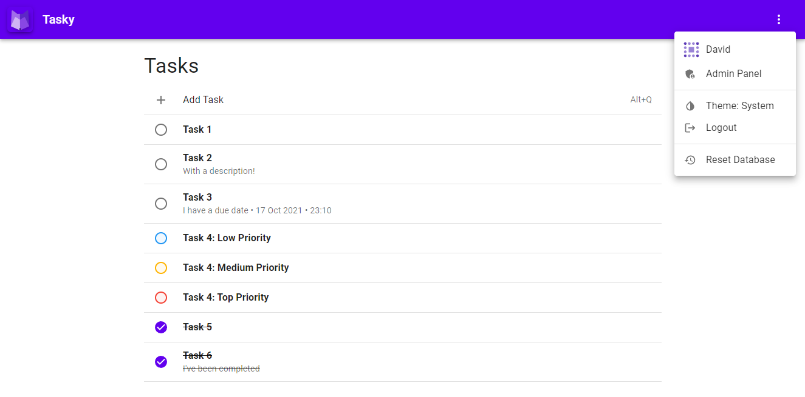

# Tasky

*Tasky is a clean and efficient todo list application*

## Project Structure

- `src/` — contains the actual application code
    - `src/components` — all of the React components that make up the views as well as the contexts ([`AuthContext`](/src/components/AuthContext.tsx), [`TaskContext`](/src/components/TaskContext.tsx), [`ThemeModeContext`](/src/components/ThemeModeContext.tsx)) that are used for storing the global state.
    - `src/views` — these are the pages (or views) that can be navigated to in the application such as [`LandingView`](/src/views/LandingView.tsx) or [`TaskView`](/src/views/TaskView.tsx).
    - The remaining folders are more general and contain typings (`src/models`), schema validation (`src/schemas`), utilities (`src/utils`, `src/hooks`) and configuration files (`src/config`).
- `src/api` — backend code
    - Express API, routes and middlewares.
    - `src/api/database` — contains the database models and code for connecting to the database.
- `.vscode`
    - Code snippets for easy consistent component definitions throughout the project.
    - Recommended extensions and workspace settings
- `.github` — continuous integration jobs
